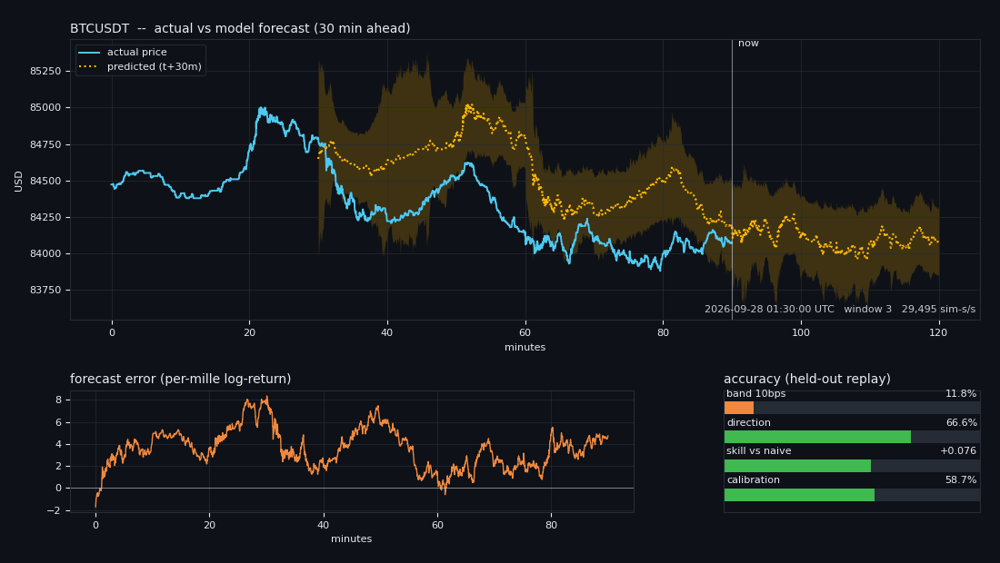

# pridictior_snow4 — Bitcoin Price Predictor

Second-by-second Bitcoin forecasting, end to end: a **live market simulator**
replays the real tape, a **CPU Market Analyser** turns it into signals, and a
**GPU Price Predictor** forecasts the price **30 minutes ahead**, updating its
forecast **every second**.

Everything in this repository — the dataset included — runs **completely
offline**. Nothing is downloaded at training time, which is what lets it run
inside an air-gapped Snowflake account.

```
┌──────────────┐   1 s bars   ┌──────────────┐  40 signals  ┌──────────────┐
│   Market     │─────────────▶│   Market     │─────────────▶│    Price     │
│  Simulator   │  replayed as │  Analyser    │  per second  │  Predictor   │
│    (CPU)     │  a live feed │    (CPU)     │              │    (GPU)     │
└──────────────┘              └──────────────┘              └──────┬───────┘
                                                                   │ μ, σ, dir
       ┌───────────────────────────────────────────────────────────┘
       ▼
┌──────────────┐   smooth, tradeable   ┌──────────────┐   every 1800 s
│  Stability   │──────────────────────▶│  Prediction  │──▶ checkpoint
│   Filter     │   forecast per second │    Store     │──▶ reward / loss
└──────────────┘                       └──────────────┘    for the next cycle
```

---

## 1 · What is actually in here

| Path | What it is |
|---|---|
| `data/btcusdt_1s/` | **The dataset.** 111 monthly chunks, 2017-08-17 → 2026-10-03, **288,043,172 one-second bars**, 2.35 GB |
| `src/btcpred/compact.py` | The storage codec that makes the above fit in a git repo |
| `src/btcpred/simulator.py` | Live market simulator (tick stream *and* window stream) |
| `src/btcpred/analyser.py` | Market Analyser — 40 causal signals, O(1) per second, CPU |
| `src/btcpred/model.py` | Price Predictor — causal TCN → GRU → (μ, σ, direction) + a pure-NumPy fallback |
| `src/btcpred/distributed.py` | Intra-GPU DDP: several ranks sharing one card |
| `src/btcpred/trainer.py` | The 30-minute-epoch training loop with delayed rewards |
| `src/btcpred/stability.py` | Keeps the forecast calm enough to trade on |
| `src/btcpred/metrics.py` | Accuracy, skill, calibration, stability accounting |
| `src/btcpred/storage.py` | Per-second prediction tape + per-window checkpoints |
| `src/btcpred/viz.py` | Animated GIF, live notebook chart, self-contained HTML replay |
| `src/btcpred/env.py` | Hardware detection and automatic model sizing |
| `notebooks/snowflake_live_training.ipynb` | The Snowflake notebook — same live graph |
| `snowflake/setup.sql` | Stages, tables, GPU compute pool, notebook creation |
| `train.py` | CLI entry point |
| `live_dashboard.py` | Browser dashboard that watches a running job |
| `scripts/replay.py` | Replay a trained checkpoint over any date range, frozen weights |
| `scripts/` | Dataset builder, verifier, GitHub uploader |
| `tests/test_pipeline.py` | 35 offline self-tests, no pytest needed |
| `artifacts/` | Output of the reference run shipped with the repo |
| `runs/demo`, `runs/replay_holdout` | Real metrics, checkpoints and prediction tapes from that run |

---

## 2 · Quick start

```bash
git clone https://github.com/<owner>/pridictior_snow4.git
cd pridictior_snow4
pip install numpy                      # the only hard requirement
pip install -r requirements.txt        # torch, matplotlib, pandas … optional

python scripts/verify_dataset.py       # prove the data survived the clone
python train.py --probe                # what will this machine do?
python train.py --max-windows 500 --render
```

`--probe` prints something like:

```
[hardware] Linux x86_64 py3.11 | 16 vCPU | 64.0 GB RAM | 1x NVIDIA A10G (24.0 GB VRAM) | torch=2.4.0
[autoscale] tier=large d_model=256 layers=6 streams=16 world_size=6 amp=bf16
[plan] 6 ranks sharing 1x NVIDIA A10G (intra-GPU DDP over NCCL, per-rank CUDA streams, memory fraction 17% each)
```

Nothing above was configured. It was measured.

---

## 3 · The training contract

* **One epoch = 30 minutes of simulated market time** = 1800 one-second bars.
* The model emits a **fresh forecast every second**, predicting the price
  **1800 seconds ahead**.
* All 1800 per-second forecasts are **stored** before anything is learned from
  them.
* The label for a forecast made at second *t* does not exist until *t+1800* —
  i.e. inside the **next** window. So window *k* is scored, converted into a
  reward/loss signal, and back-propagated at the end of window *k+1*.
* A **checkpoint is written every window**.

```
window k            window k+1           window k+2
├─1800 forecasts───▶├─labels for k mature├
│  stored           │  → reward/loss      │
│                   │  → backprop         │
│                   │  → checkpoint       │
```

### Why it is still fast

The network is **strictly causal** — left-padded dilated convolutions and a
GRU, no lookahead anywhere. Evaluating all 1800 seconds of a window in one
batched forward pass is therefore numerically identical to stepping it one
second at a time. The *semantics* are per-second; the *execution* is
vectorised. `tests/test_pipeline.py` asserts this identity for the analyser
(streaming vs batched agree to 1e-8) and asserts strict causality (mutating
the future cannot change past features).

On top of that each rank runs several **lanes** — independent positions in the
tape, in different market eras — advanced in lock-step as one batch. That is
what actually fills a GPU with a model this shape.

---

## 4 · Distributed training within a single GPU

A single small sequence model cannot saturate a modern GPU: it stalls on kernel
launches and on the CPU-side analyser. So several **ranks share one physical
device**:

* each rank owns a different shard of the tape and its own GRU carry state;
* each rank gets its own CUDA stream, so one rank's kernels overlap another's
  analyser stall;
* `torch.cuda.set_per_process_memory_fraction` stops any rank starving the
  others;
* gradients are all-reduced through NCCL (DDP) — one model, N market shards.

Rendezvous uses a **file store** under the run directory, so no free TCP port
and no network access is needed. The same entry point degrades cleanly:

| hardware | what you get |
|---|---|
| 1 GPU | N ranks sharing `cuda:0` (NCCL), AMP bf16/fp16 |
| k GPUs | ranks spread round-robin across devices |
| CPU only | N ranks over gloo, model auto-shrunk |
| no torch at all | single process, hand-differentiated NumPy backend |

---

## 5 · The model scales itself

`src/btcpred/env.py` measures cores, RAM (cgroup-aware, so it is honest inside
a container), CUDA devices and VRAM, then picks a tier:

| tier | d_model | layers | ~params | lands on |
|---|---|---|---|---|
| `pico` | 48 | 2 | 30 K | 1 core |
| `nano` | 64 | 2 | 52 K | 2 cores / tiny kernel |
| `micro` | 96 | 3 | 0.3 M | 4 cores |
| `small` | 128 | 3 | 0.8 M | 8 cores |
| `base` | 192 | 4 | 2.3 M | small GPU |
| `large` | 256 | 6 | 5.5 M | 16 GB VRAM |
| `xl` | 384 | 8 | 15.7 M | 40 GB VRAM |
| `xxl` | 512 | 10 | 34.5 M | 80 GB VRAM |

Memory is budgeted at 16 bytes per parameter (fp32 weight + gradient + two Adam
moments) plus an activation allowance. Crucially the tier is **also capped by
compute**, not just memory: a 15 M-parameter model "fits" in 2 GB of RAM and
would still take minutes per window on two cores, so the CPU path is capped by
core count. Override with `--max-tier` / `--world-size` / `--lanes` if you
disagree with the machine.

---

## 6 · The dataset

Binance publishes 1-second BTCUSDT klines back to **2017-08-17**. As raw CSV
that is ~45 GB — impossible to ship in a git repository. The codec in
`compact.py` stores the same information in **2.35 GB**:

| trick | why it works |
|---|---|
| no timestamps | bars sit on a perfectly regular 1-second grid; only `t0` is stored |
| prices as **integer cents** | they are tick-quantised, never real-valued |
| close is **delta encoded** | consecutive 1-second closes barely move → < 1 byte/sample after zlib |
| open/high/low/VWAP as **offsets from the bar's own close** | tiny integers |
| taker flow as a **ratio byte** | order-flow imbalance needs 8 bits, not a float array |
| gaps **bit-packed** | silent seconds are forward-filled and flagged |

Fidelity, measured on 2.68 M bars: prices **exact** on the cent grid, quote
volume round-trips to 2e-6 %, taker-buy volume to 0.15 % (it is a ratio
feature). Decoding needs **nothing but NumPy**.

Both edges are trimmed to real data: August 2017 starts at the first trade
(2017-08-17 04:00 UTC), and the current month stops at the last published
second — otherwise the chronological hold-out split would be scored against
weeks of forward-filled flat line.

```bash
# rebuild or extend it (the ONLY script that needs internet)
python scripts/download_binance_1s.py --all
python scripts/download_binance_1s.py --all --resume     # top up new months
python scripts/verify_dataset.py --deep                  # decode every chunk
```

---

## 7 · The signals

40 causal features, all O(1) per second, all scale-free so a model trained on
$4k Bitcoin stays valid at $120k:

* **trend** — log-price distance from EMAs at 5 s … 2 h, MACD + signal +
  histogram, long-horizon slope
* **momentum** — log returns at 1 s, 5 s, 15 s, 1 m, 5 m, 15 m, 30 m,
  acceleration, RSI
* **volatility** — EMA realised vol at 1 m / 5 m / 30 m, high-low range,
  vol-of-vol
* **flow** — volume and trade-count surprise vs their own EMAs, taker-buy
  imbalance (fast and slow), VWAP deviation, notional
* **micro** — data-gap density, position inside the 15-minute envelope
* **clock** — intraday and weekly seasonality (sin/cos)

---

## 8 · Stability — because this drives trading decisions

A forecast that jumps 0.4 % between two consecutive seconds is untradeable; the
position churns itself to death in fees. Stability is enforced at three levels:

1. **In the loss** — the network is penalised for the first *and* second
   differences of its own output, so it learns to be smooth rather than being
   smoothed after the fact.
2. **At inference** — a causal three-stage filter: a confidence-weighted EMA
   (wide predicted σ ⇒ slower adaptation), a hard slew-rate limit in basis
   points per second, and a dead-band that ignores micro-revisions.
3. **In the metrics** — jitter, max slew and limiter-breach fraction are logged
   every window and checkpointed, so a regression is visible instead of silent.

---

## 9 · What "accuracy" means here

Four complementary numbers, because one would be misleading:

| metric | definition |
|---|---|
| `band_accuracy` | fraction of seconds whose predicted price lands within 10 bps of the real one — the headline progress bar |
| `direction_acc` | fraction of *material* moves whose sign was called right |
| `skill_vs_naive` | improvement over "the price in 30 minutes equals the price now" — **the only benchmark that matters** for second-by-second BTC |
| `calibration` | fraction of errors inside the model's own ±1σ (ideal ≈ 0.68) |

> **Honest framing:** 30-minute-ahead BTC returns are close to a martingale.
> A positive `skill_vs_naive` is hard-won and small; anyone reporting 99 %
> "accuracy" on this problem is measuring price level, not prediction. The
> uncertainty head exists so the model can say *"I don't know"* instead of
> guessing confidently.

---

## 10 · Results from the committed demo run

Everything below was produced **in this repository** by the command in
§2 and is committed under `runs/`. Nothing is hand-picked or simulated.

**Training** — `runs/demo`, 4 parallel lanes on a 2-core CPU box, no GPU,
`nano` tier auto-selected (51,539 parameters, torch + gloo):

| | |
|---|---|
| windows trained | **4,472** (1,118 per lane × 4 lanes) |
| simulated market time | **93.2 days** in **661 s** wall → **~12,200 simulated s/s** |
| lanes (market eras) | 2017-08→2019-10 · 2019-10→2021-12 · 2021-12→2024-02 · 2024-02→2026-04 |
| held out, never trained | **2026-04-19 → 2026-10-03** |

**Scores.** Per-window mean over the whole run, then the same model with
**frozen weights** replayed over data it never saw:

| metric | training (1,117 windows) | held-out replay, 2026-09-28→10-03 (239 windows) |
|---|---|---|
| band accuracy (±10 bps) | 26.9 % | **38.9 %** |
| direction accuracy | **60.9 %** | **56.2 %** |
| skill vs naive — median | +0.043 | +0.002 |
| skill vs naive — mean | −0.009 | −0.130 |
| calibration (ideal ≈ 0.68) | 0.744 | 0.827 |
| MAE | 3.63 ‰ | **1.84 ‰** |
| jitter (per-mille / s) | 0.0041 | **0.0019** |
| windows beating 50 % direction | **80.8 %** | 57.3 % |
| windows with positive skill | **61.3 %** | 50.6 % |

Read that honestly:

* The **directional edge is real** — 60.9 % in training and 56.2 % on data the
  model has never seen, with 4 out of 5 training windows above the coin-flip
  line. That is the result worth having.
* **Skill vs the random walk is a coin flip at the median and negative at the
  mean.** In plain terms: over 30 minutes the model is *level* with "the price
  won't change", and a handful of regime-break windows drag the average below
  it. This is the expected outcome for 30-minute spot BTC with one venue's
  trade tape and no order-book data, and it is why §16 says what it says.
* **Uncertainty is well calibrated** (0.83 vs the ideal 0.68 — slightly
  conservative) and **jitter is ~0.002 ‰/s**, i.e. the forecast line is smooth
  enough to act on rather than flickering second to second.
* Earlier 2-lane runs scored *better* on training EMA and far *worse* out of
  sample: with only two eras the model learned the 2017 bull-run drift
  (`bias_permille` +1.99) and carried it into 2026. Four eras cut that bias to
  +0.68 and fixed the hold-out. More eras, not more parameters, was the fix.

**Artifacts** (regenerate with `--render`):



| file | what it shows |
|---|---|
| `artifacts/live_prediction.gif` | the trained model replaying held-out Sept-Oct 2026 — solid actual price, **dotted** forecast shifted +30 min, ±1σ ribbon, live progress bars |
| `artifacts/live_dashboard.html` | the same replay as one self-contained offline HTML file |
| `artifacts/training_curves.png` | loss / accuracy / error / skill across all 1,118 training windows |
| `artifacts/holdout_curves.png` | the same panels for the held-out replay |
| `runs/demo/` | full `metrics.csv`, `summary.json`, the last 3 checkpoints, and a 60-window sample of the per-second prediction tape |
| `runs/replay_holdout/` | full `metrics.csv` plus 60 windows of held-out per-second predictions |

> The committed prediction tapes are **samples**. A real run keeps *every*
> window by default — 4,472 files / 138 MB for these 11 minutes — and only
> `--no-predictions` turns that off. Point `--run-dir` at your 1 PB stage and
> nothing is ever discarded; the repo ships a thinned copy purely so the clone
> stays small.

To reproduce the held-out replay against any date range:

```bash
python scripts/replay.py --run runs/demo --from 2026-09-28 --to 2026-10-03 --render
```

---

## 11 · Visualisation

Three renderers over one data model:

```bash
python train.py --max-windows 500 --render     # GIF + HTML + curves
python live_dashboard.py --port 8080           # watch a running job
```

* `artifacts/live_prediction.gif` — animated replay: actual price solid, the
  forecast dotted and plotted **at the time it predicts** (shifted +30 min), a
  shaded ±1σ ribbon, live accuracy progress bars, and a forecast-error strip.
* `artifacts/live_dashboard.html` — the same replay as a **single
  self-contained HTML file**: data embedded, chart hand-drawn on a canvas, no
  CDN and no fetch. Plays offline, inside Snowflake, or straight from disk.
* `artifacts/training_curves.png` — loss, accuracy, error and stability.
* In a notebook, `btcpred.viz.LiveChart` redraws the same figure every window.

---

## 12 · Snowflake (no internet required)

```sql
-- snowflake/setup.sql does all of this
CREATE STAGE BTCPRED_DATA;              -- the .npz chunks live here
CREATE COMPUTE POOL BTCPRED_GPU_POOL INSTANCE_FAMILY = GPU_NV_S;
CREATE NOTEBOOK BTCPRED_LIVE FROM '@BTCPRED_CODE/'
  MAIN_FILE = 'snowflake_live_training.ipynb'
  RUNTIME_NAME = 'SYSTEM$GPU_RUNTIME' COMPUTE_POOL = BTCPRED_GPU_POOL;
```

Upload once from a connected machine:

```bash
snow sql -q "PUT file://./data/btcusdt_1s/*.npz @BTCPRED.CORE.BTCPRED_DATA/ \
             OVERWRITE=TRUE AUTO_COMPRESS=FALSE PARALLEL=8"
```

Then `notebooks/snowflake_live_training.ipynb` runs with **zero outbound
network calls**: it locates the repo, probes the hardware, opens the chunk
index off local disk, trains with the live chart, and optionally writes the
prediction tape into `BTC_PREDICTIONS` for SQL/Snowsight.

Runtime support is automatic:

| Snowflake runtime | backend |
|---|---|
| Container Runtime on a GPU pool | torch + CUDA + intra-GPU DDP + AMP |
| Container Runtime on a CPU pool | torch CPU, multi-rank gloo |
| Plain warehouse notebook | NumPy backend — no deep-learning stack needed |

---

## 13 · Everything is stored

With a petabyte available, nothing is discarded:

```
runs/<run_id>/
  run.json              config, hardware profile, plan
  metrics.csv           one row per 30-minute window
  summary.json          final + held-out scores
  predictions/
    w00000000.npz       ts, price_now, mu_raw, mu_smooth, sigma, pred_price,
    …                   true_future_price, target_permille  (all 1800 seconds)
  checkpoints/
    ckpt_00000000.npz   model + analyser + filter + normaliser state
    latest.json
  live/state.json       what the dashboard polls
```

Checkpoints round-trip through `.npz`, so a run can be inspected **without
torch installed**. Writes are atomic, so a killed job leaves a readable store.
`storage.consolidate_predictions()` merges the tape into one Parquet (or
gzipped CSV) file for ingestion.

> The reference run shipped in `artifacts/` has its prediction tape and
> checkpoint history trimmed to keep the repository reasonable. A real run
> keeps every window — set `--keep-last 0` (the default).

---

## 14 · CLI reference

```
python train.py [options]

  data      --data-dir DIR         default data/btcusdt_1s
            --run-dir DIR          default runs
            --eval-fraction F      newest share held out (default 0.05)

  schedule  --epoch-seconds N      one epoch in simulated seconds (1800)
            --horizon N            forecast distance in seconds (1800)
            --max-windows N        stop after N windows
            --max-minutes M        wall-clock budget
            --speed S              simulated seconds per real second
                                   (0 = max speed, 1 = real time)

  model     --backend auto|torch|numpy
            --max-tier TIER        cap the auto-chosen model size
            --world-size N         distributed ranks
            --lanes N              parallel tape positions per rank
            --lr LR

  output    --checkpoint-every N   windows between checkpoints (1)
            --keep-last N          keep only N newest checkpoints (0 = all)
            --no-predictions       skip the per-second tape
            --live                 write live/state.json
            --render               GIF + HTML + curves at the end
            --resume               continue from the newest checkpoint
            --probe                print the hardware plan and exit

python scripts/replay.py --run runs/demo [options]   # frozen weights, no learning

            --from / --to DATE     YYYY-MM-DD window to replay
            --days N               or: the last N days of the dataset
            --checkpoint PATH      default: newest in the run
            --speed S              simulated seconds per real second
            --render               GIF + HTML + curves at the end

python live_dashboard.py --run-dir runs --port 8080  # watch a live job
python scripts/verify_dataset.py --data-dir data/btcusdt_1s
python scripts/download_binance_1s.py --from 2017-08 --to 2026-10
```

---

## 15 · Tests

```bash
python tests/test_pipeline.py                        # synthetic data, offline
python tests/test_pipeline.py --data data/btcusdt_1s # also check the real set
```

35 assertions: codec round-trip, cross-chunk window reads, vectorised-EMA ==
loop-EMA, streaming-analyser == batched-analyser, strict causality, both
backends actually learning, stability slew limits, simulator tick/window
agreement, and a full trainer run producing predictions, metrics and a
reloadable checkpoint.

---

## 16 · Limitations

* Spot BTCUSDT from one venue. No order book, no funding, no cross-exchange
  flow — those are the features that would actually move the needle.
* Silent seconds are forward-filled. Early history (2017-2018) is sparser than
  recent history; the `gap` mask is a feature so the model can tell.
* `skill_vs_naive` is the number to watch. Small positive values are a real
  result on this problem; large ones mean a bug.
* **Not financial advice.** This is a forecasting system, not a trading system:
  no execution, slippage, fees or risk model.

---

## 17 · Licence

MIT — see `LICENSE`.

Market data © Binance, redistributed from their public data portal
(<https://data.binance.vision>) under its terms of use.
